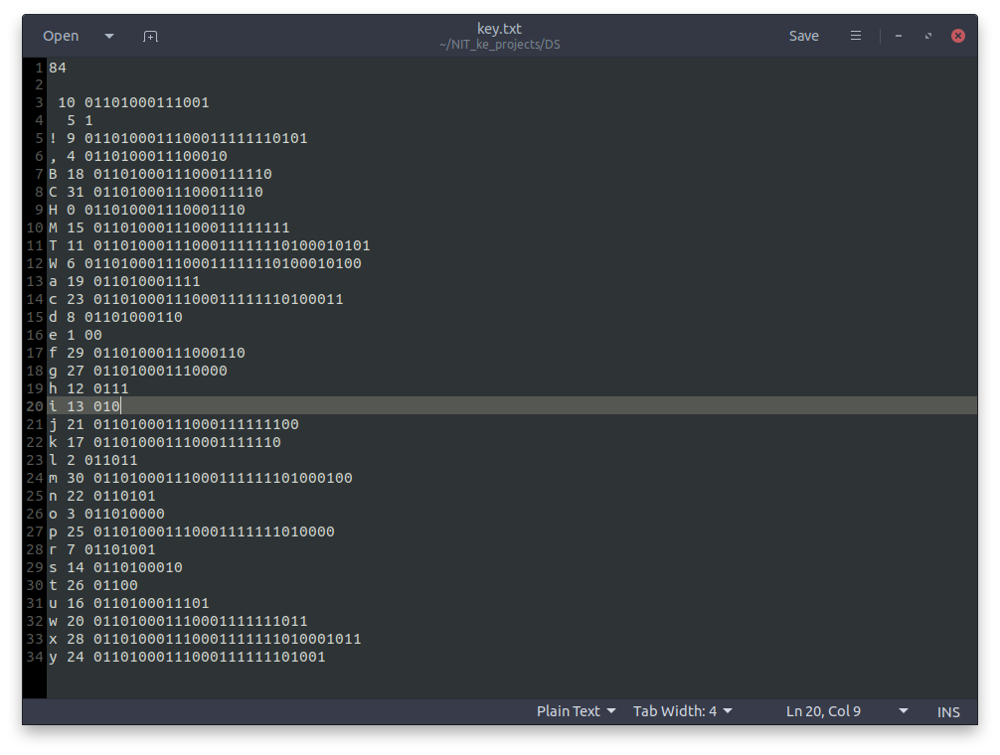
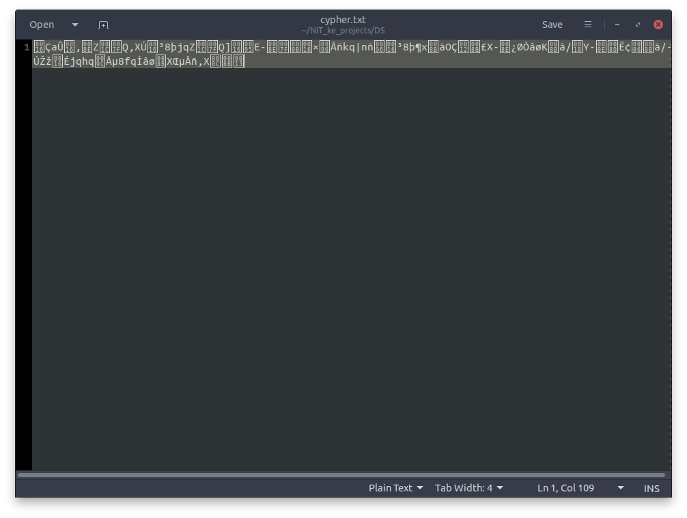
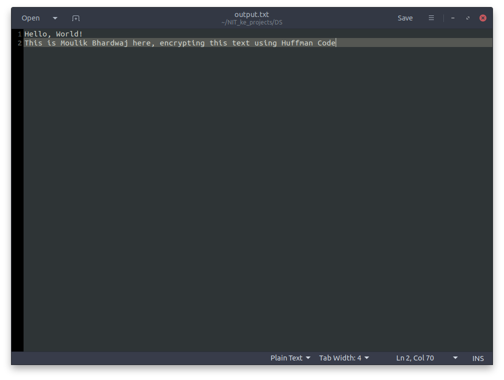

# Encryption Using Huffman Code

## Introduction
The project aims to encrypt a file, by converting it into a variant of huffman code. The underlying datastructures used in this project are:  
* Binary Trees
* Priority Queue
    * Which uses heaps, a form of binary tree

## Working of project

### Encryption
The project takes input from input file character by character, and stores the frequency of the character appeared in the input, and assigns a unique index to that character. The frequency is then later used to create Huffman tree, and the index is used as identification of that character in the key. 

At this point, we have frequency distribution of all the characters appeared in the file. Now, we create a min-heap from them, with lowest frequencies at top, which is done by priority queue in our program. The reason for this is the huffman code's property that every character is assigned a unique prefix, i.e. code of one character cannot be prefix of other character.  

While the size of priority queue is greater than or equal to 2, we extract two entries from that, and add a new entry, having frequency as the sum of the frequencies of the two extracted entries. Moreover, we create a binary tree, with all the initial elements of priority queue as the leaves.  
When we add a new element to the priority queue, we add edges between the new element and the comprising elements, with new element being parent of comprising elements. We also assign a random bit value to edge, 0 or 1, which will determine their assigned huffman code to them.

Now, we have a binary tree, with leaves as the frequency distribution of elements that appeared in the input, and edge having a bit value. Next step is to set the huffman code of elements.

Assume the huffman code of root to be null.  
Using top-down approach for tree filling, from each non-leaf node in the tree, assign the huffman code of the child as the huffman code of current node appended by the edge value between the node and the child.

This will fill the huffman tree, and assign all characters a unique value.

We output key as the following way:
1. First line of key contains the number of characters in the input file.
2. After that, all line contains:
    1. First word is the character for which it is being defined.
    2. Second word is the index assigned to that character.
    3. Third word is the huffman code assigned to the character.

Now, re read input character by character, and write out its corresponding huffman code in binary base.   
In implementation, as computers in these years are byte addressible, we use a uint8_t data type in C++ for storing, which can be regarded as an unsigned char. We keep filling the code from the back, until the 8th bit is reached, then it is outputted to cypher file, and is reset to 0, for next data input. Also, during the end of cypher, if the bitposition has not reached 8th bit, we output the bit as it is. This can give wrong output after the last correct output, but is dealt as the key contains the size of text. 

### Decryption
Decryption of cypher text requrires the key, i.e. size of input and huffman table.  
For decryption, similar to encryption, we take cypher text character by character (using uint8_t), and check the byte with the huffman codes from the key bit by bit, and when one code matches perfectly, we output the character corresponding to the huffman code. This is valid decryption, because huffman code gurarentees that the code of one character is never the prefix of other charcter. 

## How to use program
Just type `make` in terminal at root directory of project.  
To change input, change contents of input, and type `make` again  

## Authors
Moulik (185506)
Swayam Kaul (185512)
Rishabh Denkawat (185519)